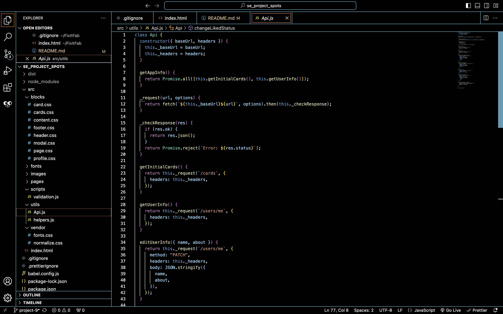
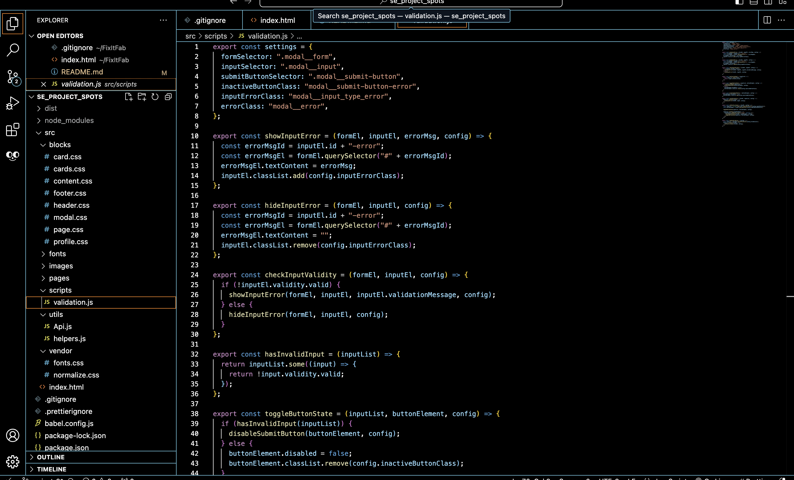
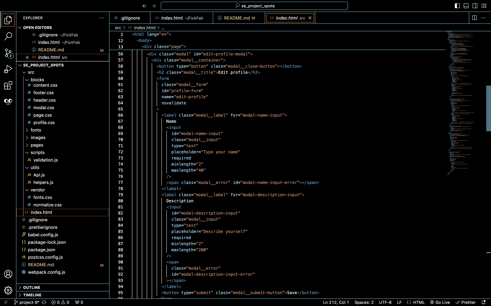
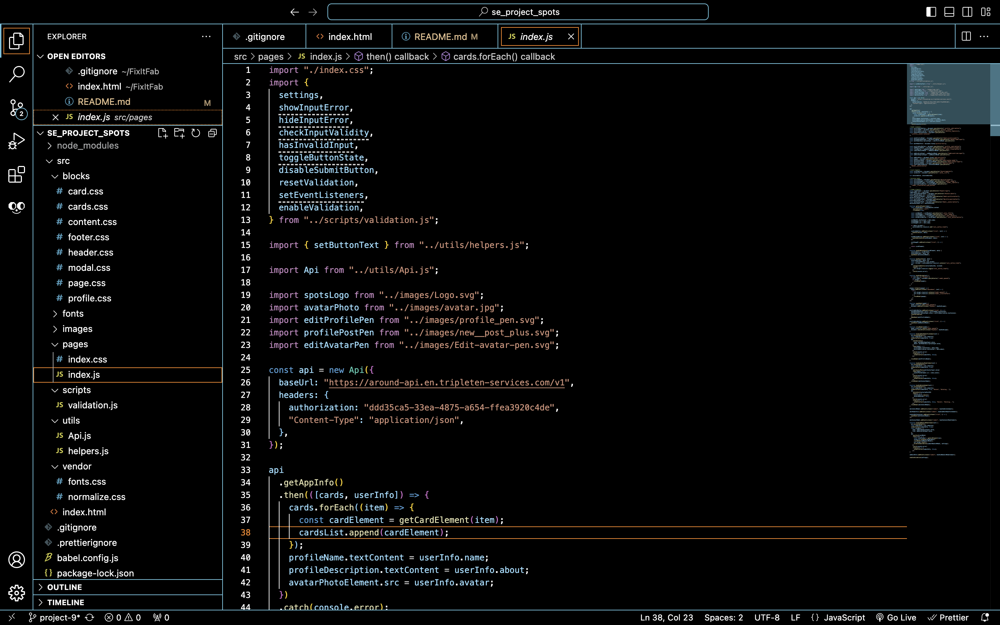
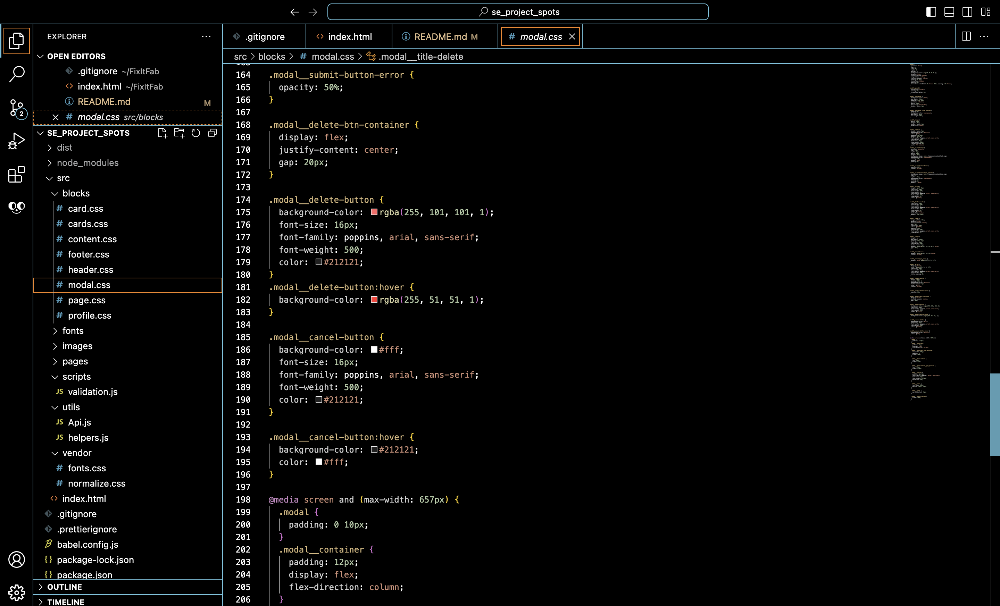
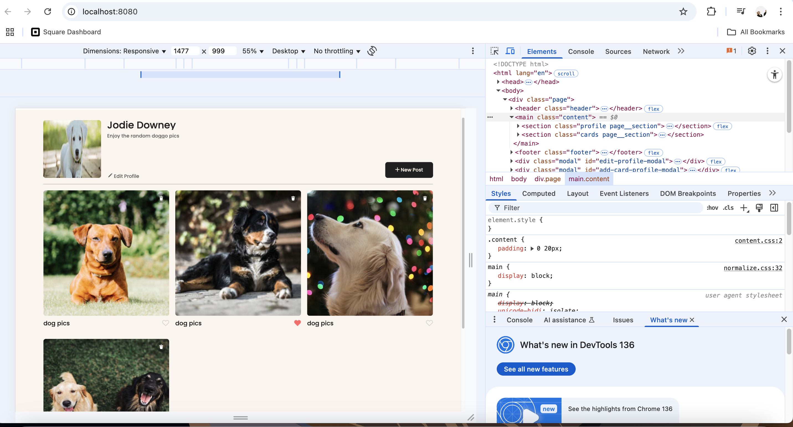

# Spots

Spots is a responsive, single-page web application that allows users to share and explore. Built with HTML, CSS, and JavaScript, the app emphasizes clean design, interactive features, and robust form validation.

## Live Demo

Explore the live application here: [Spots Live](https://jodie-downey.github.io/se_project_spots/)

## Technologies Used

- **HTML5**: Semantic structure for accessibility and SEO.
- **CSS3**: Flexbox and Grid for responsive layouts; media queries for device adaptability.
- **JavaScript (ES6+)**: Modular codebase with classes and event-driven architecture.
- **BEM Methodology**: Consistent and maintainable CSS naming conventions.
- **Form Validation**: Custom JavaScript validation ensuring user input integrity.
- **Responsive Design**: Optimized for desktops, tablets, and mobile devices.

## Features

- **User Profiles**: Edit profile information with real-time validation.
- **Image Posts**: Add new posts with images and captions.
- **Interactive Cards**: Like and delete posts dynamically.
- **Modal Windows**: Smooth pop-up forms for user interactions.
- **Form Validation**: Immediate feedback on input errors.
- **Responsive Layout**: Seamless experience across all devices.

## Code Structure

The application follows a modular architecture:

- `index.html`: Main HTML file with semantic tags.
- `styles/`: Contains BEM-structured CSS files.
- `scripts/`: JavaScript modules handling different functionalities:
  - `Card.js`: Manages card creation and interactions.
  - `FormValidator.js`: Handles form validation logic.
  - `Popup.js`: Controls modal behaviors.
  - `UserInfo.js`: Manages user profile data.
  - `Api.js` : Handles API requests

## Form Validation

Implemented custom validation to provide real-time feedback:

- Checks for empty fields, input length, and URL formats.
- Disables submit buttons until inputs are valid.
- Displays error messages adjacent to respective fields.

## Responsive Design

Utilized media queries and flexible layouts to ensure:

- Optimal viewing on various screen sizes.
- Adaptive elements that reorganize based on device width.
- Touch-friendly interactions for mobile users.

### Photos

- 
- 
- 
- 
- 
- 
- 
- 

#### Video Walk Through

[Loom Link] (https://www.loom.com/share/62be36309c3c461cac7234638b3e35a7?sid=26d8889b-6edf-454c-a6b0-89c2d1b22f15)
